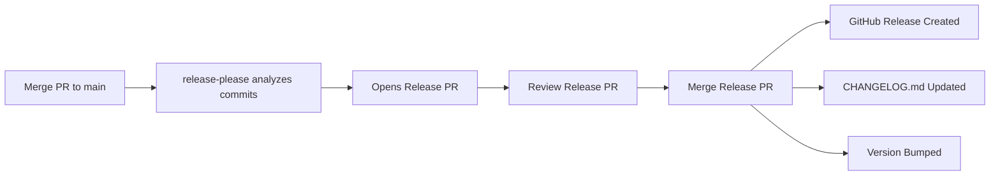

# Contributing to MCP DevTools Server

Thank you for your interest in contributing to the MCP DevTools Server! This document provides
guidelines and instructions for contributing to the project.

## Table of Contents

- [Development Setup](#development-setup)
- [Code Style Guidelines](#code-style-guidelines)
- [Testing Requirements](#testing-requirements)
- [Commit Message Conventions](#commit-message-conventions)
- [CHANGELOG Management](#changelog-management)
- [Pull Request Process](#pull-request-process)
- [Building and Running](#building-and-running)
- [Troubleshooting](#troubleshooting)

## Development Setup

### Prerequisites

- Node.js 18+ (recommended: 20 or 22)
- TypeScript 5.3+
- Git
- Go 1.19+ (for Go language support testing)
- Make (optional, for make-based commands)

### Initial Setup

1. **Fork and clone the repository:**

   ```bash
   git clone https://github.com/YOUR-USERNAME/mcp-devtools-server.git
   cd mcp-devtools-server
   ```

2. **Add upstream remote:**

   ```bash
   git remote add upstream https://github.com/rshade/mcp-devtools-server.git
   ```

3. **Install dependencies:**

   ```bash
   npm install
   ```

4. **Build the project:**

   ```bash
   npm run build
   ```

5. **Run tests to verify setup:**

   ```bash
   npm test
   ```

6. **Start the development server:**

   ```bash
   npm run dev
   ```

### NPM Version Consistency

**Important:** Use a consistent npm version across your development environment to avoid unnecessary
`package-lock.json` changes:

- **Recommended:** npm 10.x (matches CI/CD environment)
- **Check your version:** `npm --version`
- **Upgrade if needed:** `npm install -g npm@latest`

**Why this matters:**

- Different npm versions format `package-lock.json` differently
- Version mismatches cause cosmetic changes (e.g., `"peer": true` additions/removals)
- These changes add noise to PRs without affecting functionality
- Consistent versions keep diffs clean and reviewable

**If you see large package-lock.json changes:**

1. Verify your npm version matches the recommended version
2. Delete `node_modules/` and `package-lock.json`
3. Run `npm install` to regenerate with consistent npm version
4. Commit only the actual dependency changes

### Recommended Tools

- **ESLint** - Linting JavaScript/TypeScript
- **markdownlint** - Linting markdown files
- **yamllint** - Linting YAML files (optional)
- **commitlint** - Validating commit messages
- **golangci-lint** - Go code linting (for Go support testing)
- **actionlint** - GitHub Actions workflow validation

## Code Style Guidelines

### TypeScript

- Use **TypeScript strict mode** (already configured in `tsconfig.json`)
- Prefer **interfaces** over type aliases for object shapes
- Use **async/await** over Promise chains
- Add **JSDoc comments** for all public APIs
- Use **descriptive variable names** (avoid single-letter names except in loops)

### ESLint Configuration

The project uses ESLint with TypeScript support. Run linting before committing:

```bash
npm run lint
```

To auto-fix issues:

```bash
npm run lint -- --fix
```

### Markdown

- Follow [markdownlint rules](https://github.com/DavidAnson/markdownlint/blob/main/doc/Rules.md)
- Use headings hierarchically (don't skip levels)
- Add blank lines before and after code blocks
- Limit line length to 100 characters where possible

Run markdown linting:

```bash
npm run lint:md
```

### File Organization

- **src/tools/** - Tool implementations (one file per tool category)
- **src/utils/** - Utility classes and helper functions
- **src/\_\_tests\_\_/** - Test files (mirror src/ structure)
- **examples/** - Example configuration files
- **docs/** - Documentation and guides

### Code Principles

- **KISS (Keep It Simple, Stupid)** - Favor simplicity over cleverness
- **DRY (Don't Repeat Yourself)** - Extract reusable logic
- **Single Responsibility** - Each function/class should do one thing well
- **Security First** - All shell commands go through `ShellExecutor`
- **Fail Fast** - Validate inputs early and provide clear error messages

## Testing Requirements

### Minimum Coverage Requirements

- **Critical code** (ShellExecutor, security-related): **90%+ coverage**
- **Tool classes and utilities**: **85%+ coverage**
- **Overall project**: **80%+ coverage**
- **New features**: Must include tests before PR approval

### Test Structure

Tests use **Jest** with TypeScript support:

```typescript
import { describe, it, expect, jest, beforeEach } from '@jest/globals';
import { MyClass } from '../my-class.js';

describe('MyClass', () => {
  let instance: MyClass;

  beforeEach(() => {
    instance = new MyClass();
  });

  it('should perform expected behavior', () => {
    const result = instance.myMethod('input');
    expect(result).toBe('expected output');
  });

  it('should handle errors gracefully', () => {
    expect(() => instance.myMethod(null)).toThrow('Expected error message');
  });
});
```

### Running Tests

```bash
# Run all tests
npm test

# Run specific test file
npm test -- my-class.test.ts

# Run with coverage report
npm test -- --coverage

# Run in watch mode
npm test -- --watch
```

### Test Fixtures

- Use **test fixtures** in `src/__tests__/fixtures/` for complex data
- Mock external dependencies using **Jest mocks**
- Test both **success** and **failure** paths
- Include **edge cases** (empty inputs, null values, large datasets)

## Commit Message Conventions

We follow **Conventional Commits** specification:

### Format

```text
<type>(<scope>): <subject>

[optional body]

[optional footer]
```

### Types

- **feat**: New feature
- **fix**: Bug fix
- **docs**: Documentation changes
- **style**: Code style changes (formatting, no logic change)
- **refactor**: Code refactoring (no feature change)
- **test**: Adding or updating tests
- **chore**: Maintenance tasks (deps, build config)
- **perf**: Performance improvements
- **ci**: CI/CD changes

### Scope (Optional)

- **go**: Go language support
- **git**: Git tools
- **lint**: Linting tools
- **test**: Testing tools
- **shell**: Shell executor
- **security**: Security-related changes

### Examples

```bash
# New feature
feat(go): add go_benchmark tool for performance testing

# Bug fix
fix(shell): prevent command injection in argument sanitization

# Documentation
docs: update CONTRIBUTING.md with commit conventions

# Breaking change
feat(api)!: change tool schema to support parallel execution

BREAKING CHANGE: Tool input schema now requires 'version' field
```

### Validation

Commit messages are validated using commitlint:

```bash
# Validate commit message
echo "feat: add new feature" | npx commitlint

# Validate last commit
npx commitlint --from HEAD~1
```

## CHANGELOG Management

This project maintains a CHANGELOG following the [Keep a Changelog](https://keepachangelog.com/)
format. The CHANGELOG is **automatically generated** from merged pull requests and conventional
commits using [release-please](https://github.com/googleapis/release-please).

### How It Works

1. **Make conventional commits** to your feature branch (see commit conventions above)
2. **Create and merge a PR** to the main branch
3. **release-please automatically**:
   - Analyzes merged PRs and commits
   - Opens a "Release PR" that updates CHANGELOG.md and package.json version
   - Categorizes changes: feat → Added, fix → Fixed, etc.
4. **Merge the Release PR** to create a GitHub release and update CHANGELOG

### Release Process (Automated)



**You don't need to manually update CHANGELOG.md** - release-please does this automatically!

### Commit Format Mapping

release-please maps commit types to CHANGELOG sections:

- `feat:` → **Added** section
- `fix:` → **Fixed** section
- `perf:` → **Performance** section
- `refactor:` → **Changed** section
- `docs:` → **Documentation** section
- `test:`, `build:`, `ci:`, `chore:` → Hidden (not in CHANGELOG)

### Breaking Changes

To indicate a breaking change, use `!` in the commit type:

```text
feat!: change API endpoint from /v1 to /v2

BREAKING CHANGE: API endpoint has changed. Update all clients to use /v2.
```

This will:

- Bump the major version (1.x.x → 2.0.0)
- Add to "BREAKING CHANGES" section in CHANGELOG
- Highlight in release notes

### Manual CHANGELOG Edits

**Generally not needed**, but if you must manually edit:

1. Edit the Release PR that release-please creates
2. Modify the CHANGELOG.md section in that PR
3. Merge the modified Release PR

**Note:** Don't edit CHANGELOG.md directly on main - let release-please manage it.

### CHANGELOG Best Practices

- **Write clear PR titles:** They appear in the CHANGELOG
  - ✅ "Add go_test tool with coverage support"
  - ❌ "Update code"
- **Use conventional commit format:** Ensures proper categorization
- **Include context in PR descriptions:** Helps reviewers and future maintainers
- **Reference issues:** Use "Fixes #123" or "Closes #456" in PR description
- **Tag breaking changes:** Always use `!` and `BREAKING CHANGE:` for breaking changes

## Pull Request Process

### Before Submitting

1. **Create a feature branch:**

   ```bash
   git checkout -b feature/my-new-feature
   ```

2. **Make changes with tests:**
   - Write code
   - Add/update tests
   - Ensure coverage meets requirements

3. **Run full validation locally:**

   ```bash
   npm run lint
   npm run lint:md
   npm test
   npm run build
   ```

4. **Commit with conventional format:**

   ```bash
   git add .
   git commit -m "feat(scope): clear description"
   ```

5. **Push to your fork:**

   ```bash
   git push origin feature/my-new-feature
   ```

### PR Submission

1. **Open Pull Request** on GitHub
2. **Fill out PR template** completely
3. **Link related issues** using keywords (Fixes #123)
4. **Request review** from maintainers
5. **Wait for CI checks** to pass

### PR Checklist

- [ ] Code follows project style guidelines
- [ ] Tests added/updated with 80%+ coverage
- [ ] Documentation updated (README, JSDoc)
- [ ] Commit messages follow conventional format
- [ ] All CI checks pass (lint, test, build)
- [ ] No security vulnerabilities introduced
- [ ] Breaking changes documented in PR description

### Review Process

- Maintainers will review within **48-72 hours**
- Address review comments with new commits
- Once approved, maintainer will merge
- Delete your feature branch after merge

### After Merge

```bash
# Update your fork
git checkout main
git pull upstream main
git push origin main
```

## Building and Running

### Build Commands

```bash
# Clean build artifacts
npm run clean

# Build TypeScript
npm run build

# Build and run
npm run build && npm start
```

### Development Mode

```bash
# Run with auto-reload (tsx)
npm run dev

# Run with debug logging
LOG_LEVEL=debug npm run dev
```

### Testing in Claude Desktop

1. **Build first:**

   ```bash
   npm run build
   ```

2. **Update Claude config** (`~/.claude/claude_desktop_config.json`):

   ```json
   {
     "mcpServers": {
       "mcp-devtools-server": {
         "command": "node",
         "args": ["/absolute/path/to/mcp-devtools-server/dist/index.js"],
         "env": {
           "LOG_LEVEL": "debug"
         }
       }
     }
   }
   ```

3. **Restart Claude Desktop**

4. **Check logs:** `~/Library/Logs/Claude/` (macOS) or `%APPDATA%/Claude/logs/` (Windows)

## Troubleshooting

### Common Issues

#### Tests Failing

```bash
# Clear Jest cache
npx jest --clearCache

# Reinstall dependencies
rm -rf node_modules package-lock.json
npm install
```

#### Build Errors

```bash
# Clean and rebuild
npm run clean
npm run build
```

#### ESLint Issues

```bash
# Auto-fix linting issues
npm run lint -- --fix
```

#### Import Resolution Errors

- Ensure all imports end with `.js` extension (TypeScript ESM requirement)
- Check `tsconfig.json` module resolution settings

#### MCP Connection Issues

- Verify Claude Desktop config is valid JSON
- Check file paths are absolute (not relative)
- Ensure server is built before testing
- Review Claude Desktop logs for errors

### Getting Help

- **GitHub Issues:** [Report bugs or request features](https://github.com/rshade/mcp-devtools-server/issues)
- **GitHub Discussions:** [Ask questions or share ideas](https://github.com/rshade/mcp-devtools-server/discussions)
- **Documentation:** Review [README.md](README.md) and [CLAUDE.md](CLAUDE.md)

## Project Structure

```text
mcp-devtools-server/
├── src/
│   ├── index.ts                  # Main MCP server
│   ├── tools/                    # Tool implementations
│   │   ├── make-tools.ts
│   │   ├── go-tools.ts
│   │   ├── git-tools.ts
│   │   └── ...
│   ├── utils/                    # Utilities
│   │   ├── shell-executor.ts    # Secure command execution
│   │   ├── project-detector.ts  # Project type detection
│   │   └── ...
│   └── __tests__/               # Test files
├── examples/                     # Configuration examples
├── docs/                         # Generated documentation
├── .github/                      # GitHub templates
├── package.json
├── tsconfig.json
├── jest.config.js
└── README.md
```

## Code Review Guidelines

When reviewing PRs, consider:

- **Functionality:** Does it work as intended?
- **Tests:** Are there adequate tests with good coverage?
- **Security:** Are there any security vulnerabilities?
- **Performance:** Are there performance concerns?
- **Maintainability:** Is the code readable and maintainable?
- **Documentation:** Is it well-documented?
- **Breaking Changes:** Are they necessary and well-documented?

## Areas for Contribution

We welcome contributions in these areas:

### High Priority

- **Go language support** - Enhanced tooling and integration
- **Test coverage** - Reaching 80%+ across all modules
- **Documentation** - Guides, tutorials, API docs
- **Bug fixes** - See [GitHub Issues](https://github.com/rshade/mcp-devtools-server/issues)

### Medium Priority

- **Plugin system** - Extensible architecture
- **Performance** - Caching and optimization
- **New tools** - Additional language/framework support
- **CI/CD improvements** - Better automation

### Ideas Welcome

- **Workflow templates** - Common development patterns
- **Integration examples** - VS Code, GitHub Actions
- **Security enhancements** - Additional validation
- **Error handling** - Better error messages

## License

By contributing to MCP DevTools Server, you agree that your contributions will be licensed under the Apache License 2.0.

## Questions?

If you have questions about contributing, please:

1. Check existing [documentation](README.md)
2. Search [GitHub Issues](https://github.com/rshade/mcp-devtools-server/issues)
3. Open a [new discussion](https://github.com/rshade/mcp-devtools-server/discussions)

Thank you for contributing to MCP DevTools Server!
